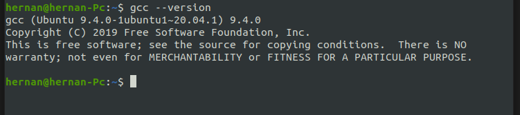
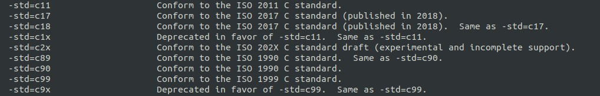
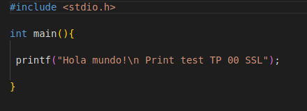
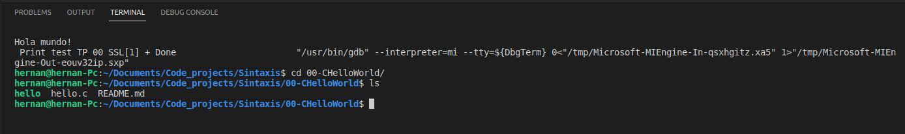
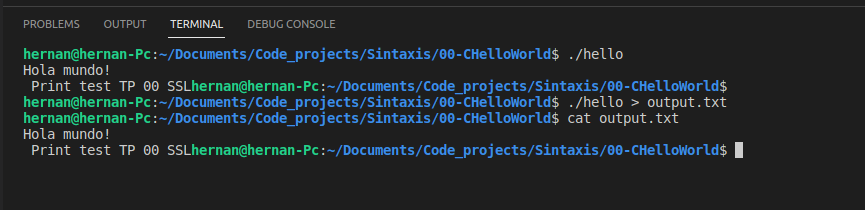

# Trabajo introductorio de SSL - Curso K2052

### Autores:

▸ Github: HernanTx

▸ Legajo: 1782496

▸ Apellido: Tresca

▸ Nombre: Hernán

<hr>

## Trabajo Nº0 "Hello World" 

1. Objetivos

    • Demostrar capacidad para editar, compilar, y ejecutar programas C mediante
    el desarrollo de un programa simple.

    • Tener un primer contacto con las herramientas necesarias para abordar la
    resolución de los trabajos posteriores.

    • Creación de repositorio personal git.

    • Armado de equipo de trabajo.

2. Temas

    • Sistema de control de versiones.

    • Lenguaje de programación C.

    • Proceso de compilación.

    • Pruebas.

3. Problema

    Adquirir y preparar los recursos necesarias para resolver los trabajos del curso.

4. Restricciones

    • Ninguna.

5. Tareas

    1. Cuenta en GitHub

        a. Si no tiene, cree una cuenta GitHub.

        b. Si no lo hizo, asocie a su cuenta GitHub el email @frba y verifíquelo. Es
        posible asociar más de una cuenta email a una cuenta GitHub.

        c. Si no lo hizo, indique que su cuenta email @frba es pública. Esto permite a la cátedra encontrar a los estudiantes. Si por temas de privacidad
        prefiere no tener como pública esa dirección, puede cambiarla al final del
        proceso. 

    2. Repositorio para público para la materia

        a. Cree un repositorio público llamado SSL.

        b. En la raíz de ese repositorio, escriba el archivo readme.md que actúa como front page del repositorio personal.

        c. Cree la carpeta 00-CHelloWorld.

        d. En esa carpeta, escriba un segundo archivo readme.md que actúa como
        front page de la resolución.

    3. Compilador

        a. Seleccione, instale, y configure, y pruebe un compilador C11 ó C18. Los
        más osados pueden buscar un compilador que soporte C23 ó C2x.

        b. Registre los resultados anteriores de la siguiente manera:

            i. Indique en el readme.md el compilador seleccionado, su versión, y la versión de C que compila.

            ii. Pruebe el compilador con un programa hello.c que envíe a stdoutla línea Hello, World! o similar.

            iii. Ejecute el programa y verifique que la salida es la esperada.

            iv. Ejecute el programa con la salida redireccionada a un archivo
            output.txt; verifique su contenido.     

    4. Publicación

        a. Publique el trabajo en el repositorio personal SSL la carpeta 00-
        CHelloWorld con readme.md, hello.c, y output.txt.

    5. Armado de Equipo.

        Aunque el trabajo es individual, fomentamos la colaboración entre
        compañeros para su resolución. Consideramos que es una buena
        oportunidad para armar equipo para los trabajos siguientes que en su mayoría
        son grupales. El docente del curso indica la cantidad de integrantes mínima
        y máxima por equipo.

        a. Informe el número de equipo en esta lista1

        Con el número de equipo y cuenta @frba, la Cátedra le envía la invitación
        al repositorio privado del equipo, por eso es importante que su cuenta
        GitHub tenga asociado como email público su email @frba, tal como indica
        el primer paso.

        b. Luego de aceptar la invitación al repositorio privado del equipo, si lo desea,
        puede cambiar el email público en GitHub.

    6. Productos
      ``` 
        Usuario // Usuario GitHub
        `-- SSL // Repositorio público para la materia
          |-- readme.md // Archivo front page del usuario
          `-- 00-CHelloWorld // Carpeta el trabajo
            |-- readme.md // Archivo front page del trabajo
            |-- hello.c // Archivo fuente del programa
            `-- output.txt // Archivo con la salida del programa
      ```  
<hr>

## Hipótesis

*Algunas hipotesis que se presentan con el enunciado pueden ser:*

•*El armado de la estructura del repositorio con sus respectivos archivos readme, esto incluye el uso de archivos markdown, los cuales ya conocia pero no acostumbro a utilizar.*

•*El proceso que realiza el compilador, los distintos compiladores de C más conocidos, por mi parte conocia GCC (el cual utilizo), MinGW (version para windows) y Clang (Mac OS). Sin embargo investigando encuentro que existen muchos otros compiladores de C y C++*

•*El redireccionamiento de un output, en este caso del programa hello, hacia un archivo cualquiera .txt, esto personalmente me resulta muy util para su aplicacion en terminales Linux ó Mac ademas de la puesta en práctica de Bash*

## Resolución

*En mi caso utilizo el compilador GCC en su version 9.4.0* 

 


*Podemos ver mediante la documentacion de la version con "gcc -v --help" que está version soporta tanto la version C11, C17, C18 y de forma parcial C2x*

 


*Realizo el programa que devuelva el "hola mundo" en C*




*Compruebo la compilación del programa hello.c, lo cual nos crea el ejecutable hello en la misma carpeta*




*Compruebo el output con el ejecutable hello y direcciono a output.txt y por ultimo verifico el contenido de dicho txt*


